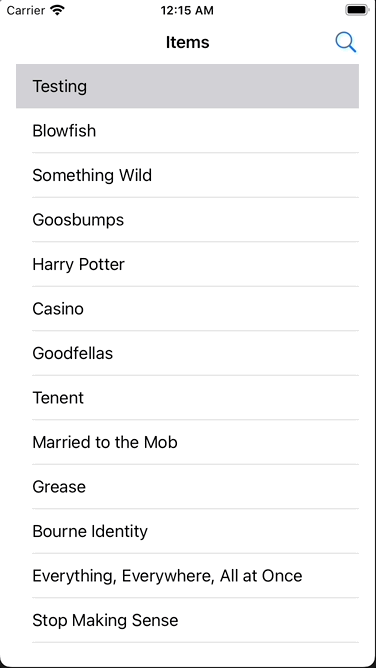

# Searching in a UITableView Demo

Simple app that shows a UITableView where one can search for rows that match a search term. Shows one way to show/hide
a search field and to update the contents without having to invoke `reloadData()` or other hacky bits. Comes with unit 
tests and UI tests.

